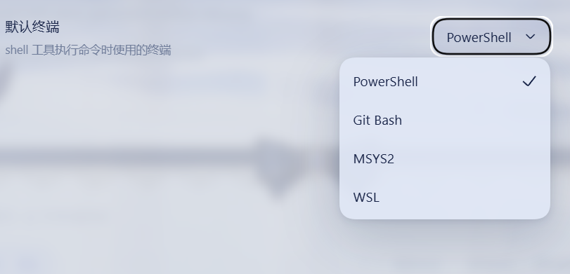

# dsh-bash-terminal-ts

> 🌐 [简体中文](README.md) | [English](README.en.md) | [Français](README.fr.md) | [Deutsch](README.de.md) | [Italiano](README.it.md) | [Русский](README.ru.md) | [Español](README.es.md) · Communauté : [LINUX DO](https://linux.do) · [GitHub](https://github.com/drscrewdriver/dsh-bash-terminal-ts)


Plugin DSH (DeepSeek Harness) : un outil `shell` qui exécute de manière unifiée sous Windows les commandes de **quatre** terminaux — **PowerShell / Git Bash / MSYS2 / WSL**.

> **Ce dépôt est une réécriture TypeScript de `MAXeaglet/dsh-bash-terminal`**, avec une prise en charge fonctionnelle de MSYS2/MINGW64. Les lignes de compatibilité sont découpées par segment de version de l'hôte DSH ; toutes les lignes partagent le nom de paquet `dsh-bash-terminal-ts` et se distinguent par un dist-tag npm :
>
> | Segment DSH | Branche | Version du plugin | dist-tag npm |
> |--------|------|----------|--------------|
> | `>=0.2.0-rc.1 <0.2.1-0` | `compat/0.2.0` (cette branche) | 0.7.x | `dsh-0.2.0` |
> | 0.1.7-rc.1 – 0.1.7.x | `compat/0.1.7` | 0.6.x | `dsh-0.1.7` |
> | 0.1.5-alpha.1 – 0.1.5-rc.x | `ts/0.1.5` (historique, gelée) | ≤ 0.5.2 | `dsh-0.1.5` |
> | 0.1.2-alpha.1 – 0.1.2-rc.x | `main` (historique, gelée) | ≤ 0.4.2 | `dsh-0.1.2` |
>
> Choisissez la ligne correspondant à votre version de DSH ; les séries de versions ne se chevauchent pas, une installation avec `^` ne peut donc pas résoudre d'une ligne à l'autre.

| Backend | Exécution réelle | Syntaxe / chemins | Variables d'environnement |
|------|----------|-------------|----------|
| `powershell` (par défaut) | `pwsh -NoLogo -NoProfile -NonInteractive -Command <cmd>` | PowerShell ; `C:\...` | `$env:NAME` |
| `gitbash` | `bash -lc <cmd>` du Git for Windows | POSIX ; `/d/workspace` ; PATH incluant `/usr/bin` et `/mingw64/bin` | `$NAME` |
| `msys2` | `bash -lc <cmd>` MSYS2 (`C:\msys64\usr\bin\bash.exe`) | POSIX ; `/c/...` ; PATH incluant `/usr/bin` et `/mingw64/bin` (gcc / make) | `$NAME` (injection automatique de `MSYSTEM=MINGW64`) |
| `wsl` | `wsl [-d <distro>] -e bash -lc <cmd>` | Linux ; `/mnt/d/...` | `$NAME` (via WSLENV) |

Chaque appel démarre un shell entièrement neuf : **aucun état n'est conservé** (cwd / variables / alias) — passez `workdir` au lieu d'utiliser `cd`.

## Aperçu de l'interface

La ligne « Terminal par défaut » dans Paramètres → Général : l'utilisateur choisit entre PowerShell / Git Bash / MSYS2 / WSL, et l'outil `shell` s'exécute strictement selon ce réglage, sans que le modèle puisse le contourner :



## Points de conception

- **Le terminal est décidé par l'utilisateur, l'IA ne peut pas le changer** : la page de réglages de l'UI Web (Paramètres → Général) affiche une liste déroulante « Terminal par défaut » (PowerShell / Git Bash / MSYS2 / WSL) ; l'outil `shell` utilise toujours exclusivement ce réglage et n'expose aucun paramètre de terminal au modèle. Le réglage est persisté via le système de settings de DSH (settings.yaml).
- **N'occupe pas le point d'extension `ctx.shell`** : l'outil `pwsh` sandboxé fourni avec DSH reste disponible tel quel ; l'outil `shell` de ce plugin constitue un point d'entrée multi-terminal **supplémentaire**.
- Les processus sont dérivés via le seam partagé `ctx.subprocess` : arrêt de l'arborescence de processus (`taskkill /T` sous Windows), SIGTERM → grâce → SIGKILL, fichiers de spill de sortie — comportement identique à celui des outils officiels `dsh-tool-bash` / `dsh-tool-pwsh`.
- Les tâches d'arrière-plan sont enregistrées dans le registre générique `jobs`, avec prise en charge de `run_in_background` / `job_output` / `job_kill`.
- La ligne « Terminal par défaut » de la page de réglages frontale est une énumération (automatiquement rendue en liste déroulante par l'UI) ; à chaque appel, le modèle s'exécute selon ce réglage et ne peut pas changer de terminal de son propre chef.

## Installation (profil web)

### Installation standard (après publication npm, mécanisme officiel de bundle)

Le plugin embarque le manifeste officiel `dsh.bundle` (`cordis.patch.yml` dans le paquet) ; dès qu'un profil liste ce paquet, DSH **applique automatiquement le montage**, sans qu'il soit nécessaire de modifier la configuration du profil à la main :

```powershell
# 1. Installer le paquet du plugin
npm install -g dsh-bash-terminal-ts
dsh plugin --profile web add dsh-bash-terminal-ts   # ajout automatique aux bundles du profil et application du patch

# 2. Patcher la liste blanche des réglages DSH (limitation DSH, voir l'explication ci-dessous)
powershell -ExecutionPolicy Bypass -File install.ps1 install

# 3. Redémarrer dsh web
```

> Vérifié en pratique avec un profil temporaire : `bundles: [dsh-bash-terminal-ts]` → l'entrée `tool-bash-terminal` apparaît automatiquement dans le dump-config.

### Installation pour développement local (junction, effet immédiat des modifications du code source)

```powershell
# 1. Lier le paquet du plugin aux node_modules du profil (junction, les modifications du code source prennent effet immédiatement)
$profile = "$env:USERPROFILE\.dsh\profiles\web"
New-Item -ItemType Junction -Path "$profile\node_modules\dsh-bash-terminal-ts" -Target "D:\workspace\projects\dsh-bash-terminal-ts" | Out-Null

# 2. Permettre au plugin de résoudre les dépendances @deepseek-ai/* (junction vers l'arbre de dépendances du profil ; le plugin et l'hôte partagent la même instance des modules)
New-Item -ItemType Junction -Path "D:\workspace\projects\dsh-bash-terminal-ts\node_modules\@deepseek-ai" -Target "$profile\..\node_modules\@deepseek-ai" | Out-Null

# 3. Laisser le profil monter le plugin via le bundle officiel (install.ps1 install le fait automatiquement ; équivaut à ajouter "dsh-bash-terminal-ts" à dsh.profile.bundles)
# 4. (uniquement après modification du code front-end) reconstruire le bundle client :
#    cd D:\workspace\projects\dsh-bash-terminal-ts && node scripts/build-client.mjs
# 5. Redémarrer dsh web
```

> ⚠️ **N'exécutez pas `npm install` dans ce projet** : cela supprimerait la junction de l'étape 2 ci-dessus et installerait pour le plugin une copie **indépendante** de
> `@deepseek-ai/*` — le plugin et l'hôte ne partageraient alors plus les instances de modules, et après une montée de version de l'hôte, le plugin resterait bloqué sur l'ancienne API
> (ce projet s'est ainsi retrouvé bloqué sur 0.1.0-rc.6). Pour ne rafraîchir que le lock, utilisez `npm install --package-lock-only`.

> **Compatibilité** : exige DSH ≥ **0.1.7-rc.1** (ligne `compat/0.1.7`) ou ≥ **0.2.0-rc.1** (ligne `compat/0.2.0`, cette branche).
> Contexte historique : en 0.1.5, `@deepseek-ai/dsh-client-runtime` dans la table des modules client a été renommé `@deepseek-ai/dsh-client-store` et n'est résolu que par correspondance exacte du nom nu ; les anciens bundles échouent sur le nouvel hôte avec
> `Failed to load plugins` / `require(...) missed the module table`.
>
> Par ailleurs : depuis 0.1.5, la surface de réglages Web repose sur l'énumération dynamique `settings.describe()` et **n'a plus de liste blanche de namespaces**
> (`settings-not-exposed` n'existe plus) ; le patch de liste blanche présent dans `install.ps1` n'est qu'un vestige historique, il peut être ignoré.

> Il n'est désormais plus nécessaire de modifier manuellement le `cordis.patch.yml` du profil : le paquet du plugin embarque son propre `dsh.bundle.patch` (`cordis.patch.yml` dans le paquet) ; dès que `dsh-bash-terminal-ts` figure dans le `dsh.profile.bundles` du profil, DSH monte automatiquement le plugin.

Vérifier l'arbre combiné (sans redémarrage) :

```powershell
node "$env:APPDATA\nvm\<node-version>\node_modules\@deepseek-ai\dsh\lib\bin.js" --profile web --dump-config | Select-String dsh-bash-terminal-ts
```

## Utilisation

**L'utilisateur choisit le terminal par défaut dans l'UI Web** : ouvrez les paramètres (roue dentée) → Général → liste déroulante « Terminal par défaut », puis choisissez l'un des terminaux PowerShell / Git Bash / MSYS2 / WSL. Le changement prend effet immédiatement et est persisté.

Lorsque le modèle voit l'outil `shell`, il l'emploie automatiquement avec le terminal que vous avez choisi (l'outil n'expose pas de paramètre de terminal ; le modèle ne peut pas changer votre choix) :

- Terminal par défaut = Git Bash : `shell(command: "git status")` passe par Git Bash
- Terminal par défaut = MSYS2 : `shell(command: "gcc --version")` passe par MSYS2 (environnement MINGW64, gcc et make de `/mingw64/bin` disponibles)
- Terminal par défaut = WSL : `shell(command: "ls -la /mnt/d/workspace")` passe par WSL ; `distro: "Ubuntu"` permet de préciser la distribution
- Terminal par défaut = PowerShell : `shell(command: "Get-Process node")` passe par PowerShell

## Exemples d'utilisation pour le modèle

- Commande ponctuelle (terminal par défaut) : `shell(command: "git status", description: "voir l'état git")`
- État conservé d'un tour à l'autre (interactif) : `terminal(action: "open")` → noter le `sessionId` → `terminal(action: "send", sessionId, input: "cd /d/project\n")` → `terminal(action: "send", sessionId, input: "npm run dev\n")` → `terminal(action: "close", sessionId)`
- Interrompre un programme en cours d'exécution : `terminal(action: "signal", sessionId, signal: "SIGINT")`
- Consulter les sessions actives : `terminal(action: "list")`
- Escalade après un refus du bac à sable : `shell(command: ..., sandbox_permissions: "workspace-write", justification: "...")`

## Configuration

**Réglages de l'UI Web** (recommandé) : Paramètres → Général → « Terminal par défaut ».

Le `config` de la ligne du plugin (surcharge les valeurs par défaut et sert de base de composition pour les réglages) :

| Clé | Par défaut | Description |
|----|------|------|
| `defaultShell` | `powershell` | Backend utilisé lorsque les réglages ne surchargent pas |
| `timeoutMs` | 120000 | Délai d'expiration par défaut |
| `maxTimeoutMs` | 600000 | Plafond du timeoutMs de l'appelant |
| `pwshPath` | détection automatique | Chemin fixe de pwsh.exe |
| `gitBashPath` | détection automatique | Chemin fixe de git bash.exe |
| `msys2Path` | détection automatique (`C:\msys64\usr\bin\bash.exe` en priorité, repli sur `msys2.exe`) | Chemin fixe de MSYS2 bash.exe |
| `wslPath` | détection automatique | Chemin fixe de wsl.exe |

## Publication (npm)

Le compte npm a la vérification 2FA activée pour la publication ; un code à usage unique est requis :

```powershell
cd D:\workspace\projects\dsh-bash-terminal-ts
npm publish --otp <code>   # le code provient de votre authentificateur
```

Avant de publier, faites un `npm pack --dry-run` pour vérifier le contenu, puis lancez `npm run build` pour tout reconstruire (compilation serveur tsc + bundle client + compilation des tests).

## Désinstallation

Exécutez simplement :

```powershell
powershell -ExecutionPolicy Bypass -File install.ps1 uninstall
```

Cette commande supprime les junctions, restaure la liste blanche des réglages, nettoie les blocs de montage `cordis.patch.yml` laissés par les anciennes versions et retire `dsh-bash-terminal-ts` du `dsh.profile.bundles`. Redémarrez ensuite dsh web.

En cas de désinstallation manuelle, outre la suppression de `node_modules\dsh-bash-terminal-ts`, pensez également à retirer `dsh-bash-terminal-ts` du `dsh.profile.bundles` du `package.json` du profil.

## Terminal interactif (outil `terminal`)

L'outil `terminal` fournit des **sessions interactives persistantes** sur le seam PTY (node-pty ; sous Windows, l'inspecteur de processus du `spawnTerminal` amont ne prenant en charge que POSIX, `lib/terminal.js` se connecte directement à node-pty ; hors Windows, le `ctx.subprocess.spawnTerminal` officiel reste utilisé) :

- `action: open` démarre une véritable session de terminal (selon votre terminal par défaut réglé ; pour wsl, `distro` peut être précisé) et renvoie un `sessionId`
- `action: send` écrit l'entrée et lit la nouvelle sortie ; `action: read` lit sans écrire ; `action: signal` envoie un signal au groupe de processus de premier plan (SIGINT = Ctrl+C)
- `action: close` met fin à la session
- **L'état de la session persiste entre les appels** (cwd / variables / alias), idéal pour les REPL, ssh et les CLI interactifs
- `send` attend la stabilisation de la sortie (300 ms de silence, plafond 5 s) et renvoie la **réponse complète** ; au-delà de 1 Mo de sortie, un avertissement `truncated` est émis
- L'entrée se termine par `\\n` (ou \\r) pour matérialiser la touche Entrée

## Bac à sable (intégration au mécanisme officiel)

L'outil `shell` emprunte le seam officiel de bac à sable de DSH (`ctx.sandboxPolicy` + `ctx.sandbox`) :

- À chaque appel, la politique de bac à sable courante est résolue ; les sessions `danger-full-access` s'exécutent directement (sans enveloppement).
- Le backend PowerShell enveloppe argv via `ctx.sandbox.confine` — sémantique **fail-closed** identique à celle des exécuteurs officiels : si le mode restreint est demandé alors qu'aucun backend n'est disponible, une `SandboxUnavailableError` est levée, refusant toute exécution nue.
- Le backend Git Bash n'est pas enveloppé : le runner à jeton restreint ACL Windows de DSH est incompatible avec Cygwin/MSYS2 (bash s'arrête dès le démarrage avec l'erreur Win32 5 de `CreateFileMapping`) ; Git Bash s'exécute donc, même en mode restreint, sans enveloppement sandbox ; le résultat rapporte `enforcement: gitbash-unconfined`.
- Le backend MSYS2 n'est pas enveloppé non plus (même incompatibilité d'exécution Cygwin/MSYS2) ; le résultat rapporte `enforcement: msys2-unconfined`.
- Le backend WSL n'est pas enveloppé : la VM Linux indépendante de WSL constitue en soi l'isolation (le résultat rapporte `enforcement: wsl-isolation`).
- En cas de refus par le bac à sable en mode restreint, le résultat porte le marqueur officiel `[sandbox: file access denied under <mode> mode]` ainsi que l'indice d'escalade du même tour ; le modèle peut déclencher une escalade à l'aide de `sandbox_permissions` + `justification` (approbation de l'utilisateur via `ctx.approval`), exactement comme les outils officiels bash/pwsh.
- Remarque : lorsque le runner ACL Windows de DSH est disponible, le mode restreint de PowerShell est enveloppé par son intermédiaire ; Git Bash et MSYS2 restent non enveloppés en raison de l'incompatibilité Cygwin/MSYS2.

## ⚠️ Note de sécurité

En mode restreint, l'outil `shell` : PowerShell est enveloppé via `ctx.sandbox.confine` (fail-closed) ; Git Bash et MSYS2 ne sont **pas enveloppés** en raison de l'incompatibilité entre Cygwin/MSYS2 et les jetons restreints ACL Windows (mêmes privilèges que le processus dsh) ; WSL n'est pas enveloppé grâce à sa VM Linux indépendante. Il s'agit d'un **point d'entrée multi-terminal supplémentaire** qui ne bénéficie pas des restrictions ConstrainedLanguage de l'outil officiel `pwsh`. Les outils de manipulation de fichiers de DSH (read/write/edit) restent soumis au bac à sable de fichiers. N'utilisez-le que dans des sessions de confiance ; pour un PowerShell protégé par le bac à sable, continuez d'utiliser l'outil officiel `pwsh`.

## Limitations connues du terminal interactif (ConPTY)

- **PowerShell 5.1 ne peut pas démarrer dans un ConPTY** (0x8009001d) — pour un PowerShell interactif, installez [PowerShell 7](https://github.com/PowerShell/PowerShell/releases) (les commandes ponctuelles ne sont pas affectées).
- **Le mode interactif de wsl.exe peut déclencher une erreur RPC du service WSL sous ConPTY** (0x8007072c, intermittent) — les commandes ponctuelles `wsl -e bash -lc ...` fonctionnent normalement ; pour les sessions interactives, préférez Windows Terminal / un terminal WSL, ou réessayez.
- **node-pty n'accepte pas les signaux nommés sous Windows** : `SIGINT` de `signal` est traduit en Ctrl+C (`\x03`) ; les autres signaux (`SIGTERM` / `SIGKILL` / `SIGTSTP` / `SIGHUP`) se dégradent en simple terminaison de session.
- Les sessions interactives Git Bash fonctionnent parfaitement.

## Limitations connues

- Les processus d'arrière-plan WSL peuvent subsister brièvement dans la distribution après un dépassement de délai ou une interruption (l'instance WSL s'éteint automatiquement après la sortie du dernier processus).
- Git Bash est un environnement msys2, avec des différences par rapport au comportement Linux de WSL (mappage des chemins, disponibilité des paquets).
- Le backend MSYS2 nécessite une installation locale de MSYS2 (`C:\msys64` par défaut) ; sans installation, `shell` signale `backend unavailable`, et `msys2Path` permet de préciser un emplacement personnalisé. L'ordre des candidats reste toujours `bash.exe` en priorité et `msys2.exe` en repli — avec un stdio en pipeline, `msys2.exe` renvoie silencieusement zéro octet et ne doit servir qu'en dernier recours.
- Ce plugin n'enregistre ses outils que sur la plateforme `win32`.

## Tests

```powershell
cd D:\workspace\projects\dsh-bash-terminal-ts
npm install          # installer les dépendances (typescript inclus)
npm run build        # compilation tsc de src/*.ts → lib/*.js ; client.tsx → lib/client.js + dist/client.js ; test/*.ts → test-dist/
npm test             # node test-dist/unit.js → apply.js → client.js → terminal.js
```

Le code source est en TypeScript (`strict` + `noUncheckedIndexedAccess`) ; les produits de compilation `lib/` et `dist/` sont commités avec le dépôt, et DSH se charge directement depuis `lib/index.js`, utilisable sans installation.
